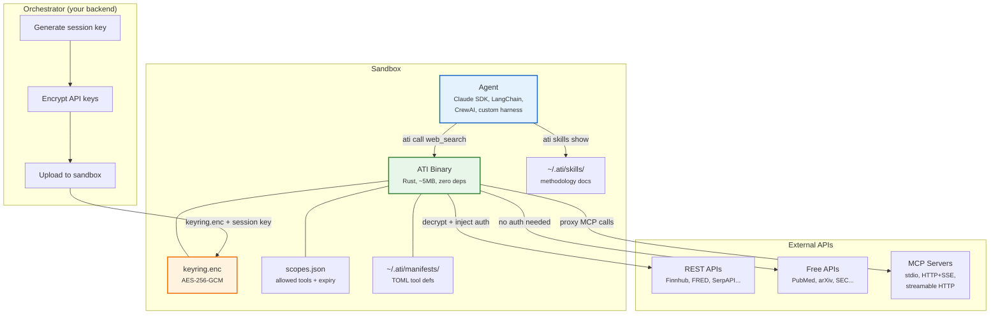
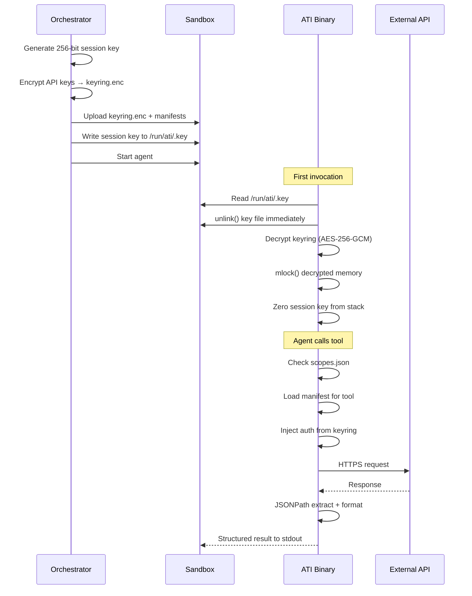
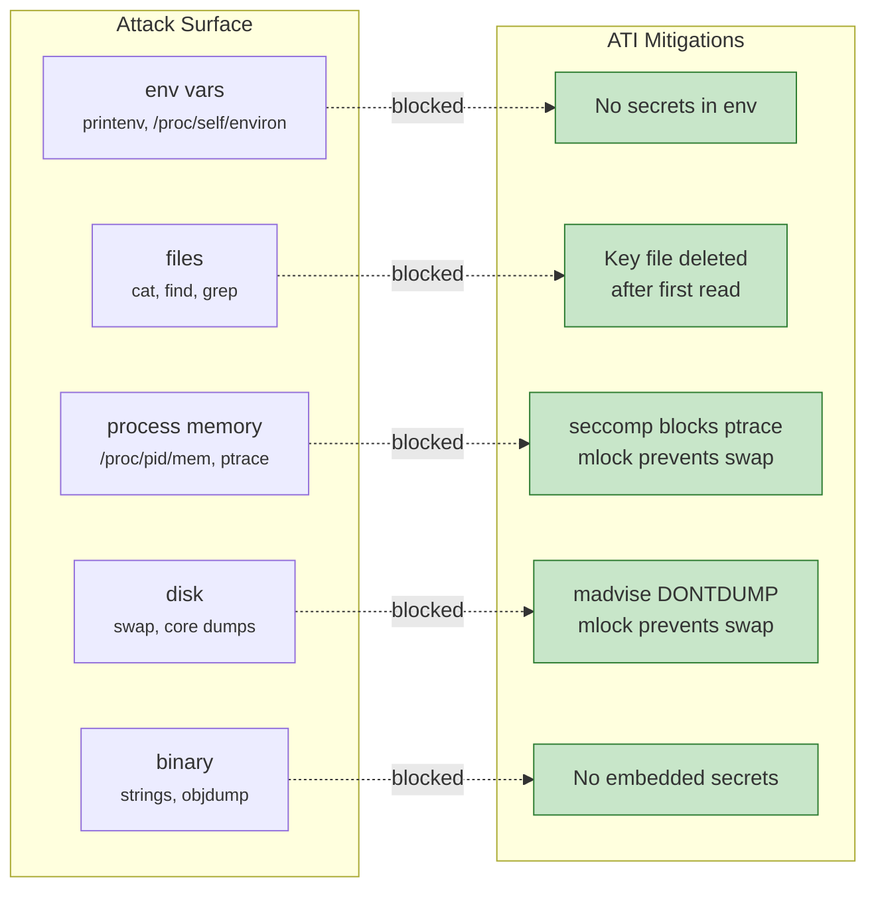
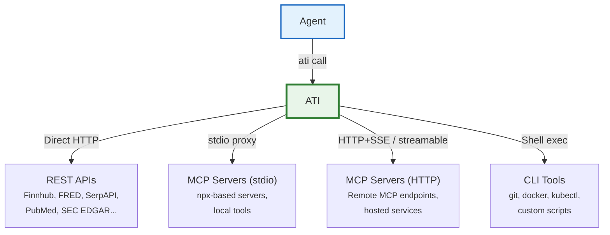
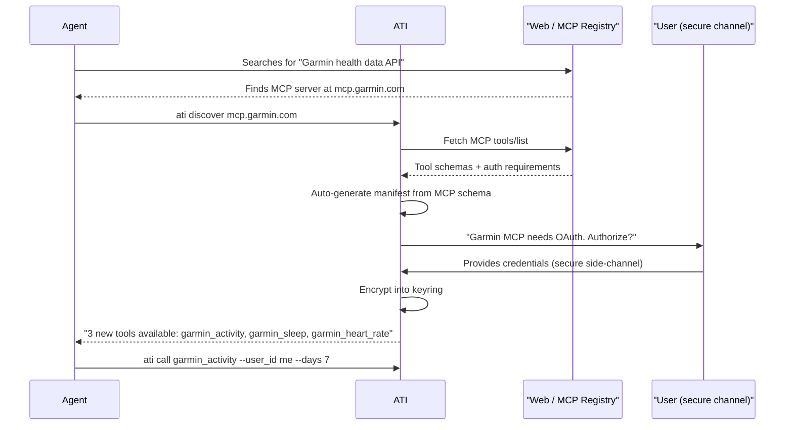

<p align="center">
  <h1 align="center">ATI</h1>
  <p align="center"><strong>Agent Tools Interface</strong></p>
  <p align="center">The unified tool layer for AI agents. MCP servers, REST APIs, CLIs, and skills — one secure binary.</p>
</p>

<p align="center">
  <a href="#quickstart">Quickstart</a> &nbsp;&bull;&nbsp;
  <a href="#built-for-agents">Built for Agents</a> &nbsp;&bull;&nbsp;
  <a href="#security">Security</a> &nbsp;&bull;&nbsp;
  <a href="#tool-manifests">Manifests</a> &nbsp;&bull;&nbsp;
  <a href="#vision">Vision</a> &nbsp;&bull;&nbsp;
  <a href="docs/SECURITY.md">Security Docs</a>
</p>

---

## The Problem

AI agents need tools. Search the web, query a database, check a stock price, file a patent search, decode a VIN. Today, giving an agent access to an external API means one of:

1. **Expose API keys** in environment variables, config files, or MCP server configs — readable by the agent with `printenv`, `cat`, or `os.getenv()`
2. **Write integration code** for every API — an MCP server, a wrapper function, a plugin — even when the logic is always the same: parse args, add auth, make request, format response
3. **Manage a zoo of runtimes** — Node.js for this MCP server, Python for that wrapper, Go for this CLI tool

The result: agents swim in leaked credentials, teams drown in boilerplate, and every new API is a deployment.

## The Solution

ATI is a single Rust binary that unifies how agents interact with external tools.

```bash
# The agent runs this. That's it.
ati call web_search --query "quantum computing breakthroughs 2026"
```

No API keys in the environment. No MCP server to spin up. No Python wrapper. ATI decrypts the credential from its encrypted keyring, injects the auth header, makes the request, formats the response, and returns it. The agent never sees the key.

### Quickstart

```bash
# Install
cargo install --path .

# Agent discovers what tools are available
ati tools list

# Agent calls a tool
ati call finnhub_quote --symbol AAPL

# Agent asks what tool to use (LLM-powered)
ati help "I need to look up SEC filings for Tesla"

# Agent loads a research methodology
ati skills show financial-due-diligence
```

---

## Built for Agents

ATI isn't a developer tool that agents happen to use. It's designed from the ground up for autonomous AI agents operating in sandboxed environments.

### Natural Language Tool Discovery

Agents don't read manifests. They ask questions.

```bash
$ ati help "I need to find academic papers about transformer architectures"

Found 3 relevant tools:

  academic_search_arxiv        Search arXiv preprint repository
  academic_search_crossref     Search published papers via Crossref
  academic_search_semantic_scholar  Search Semantic Scholar with citation data

Suggested: academic_search_semantic_scholar
  Best for finding papers with citation context and influence scores.

Example:
  ati call academic_search_semantic_scholar --query "transformer attention mechanism" --limit 10
```

`ati help` uses a fast LLM to match natural language queries to available tools, explains *why* it recommends one, and gives a ready-to-run command. The agent can pipe this directly into its next action.

### Context-Aware Output

Large API responses waste tokens. ATI processes responses *before* they reach the agent:

```bash
# JSONPath extraction — only return what matters
ati call getIncomeStatement --ticker AAPL --limit 20
# Response config extracts $.income_statements[*].{revenue, net_income, period}

# Structured formats the agent can parse efficiently
ati --output table call finnhub_quote --symbol AAPL
ati --output json call web_search --query "Parcha AI"
```

Every manifest can define a `[tools.response]` section with JSONPath extraction and output format. The agent gets clean, minimal data instead of 50KB JSON dumps. Inspired by context optimization approaches like [Context+](https://github.com/ForLoopCodes/contextplus) — reducing token waste is a first-class concern.

### Skill Discovery and Methodology

Tools give agents data. Skills give agents *judgment*.

```bash
$ ati skills list

  financial-due-diligence     Step-by-step financial analysis methodology
  patent-search               Patent landscape analysis approach
  adverse-media-screening     Media screening with source verification
  competitive-intel           Competitive intelligence gathering framework

$ ati skills show financial-due-diligence

# Financial Due Diligence
## Step 1: Company Identification
  Verify entity using SEC EDGAR CIK lookup and cross-reference with...
## Step 2: Financial Health
  Pull 3 years of income statements, balance sheets, and cash flows...
## Step 3: Risk Signals
  Check for material weaknesses, auditor changes, restatements...
```

Skills are versioned methodology documents in `~/.ati/skills/<name>/SKILL.md`. They're the "how to think about this" that turns a tool-calling agent into a domain expert. Think [Tessl](https://tessl.io/) for agent skills — structured context that makes agents behave like experienced practitioners, not just API callers.

---

## Architecture



### Key Delivery Flow



The agent harness can be anything — [Claude Agent SDK](https://docs.anthropic.com/en/docs/agents-and-tools/agent-sdk), LangChain, CrewAI, OpenAI Agents SDK, a custom loop, a bash script. ATI is a CLI binary on `$PATH`. If the agent can shell out, it can use ATI.

---

## Security

Every design decision starts with one assumption: **the agent is untrusted**.

It can run arbitrary shell commands. It can read files. It can inspect processes. It will try to extract credentials if prompted to do so (intentionally or via injection). ATI makes that extraction infeasible.

### Threat Model



| Attack Vector | What the Agent Tries | ATI's Defense |
|--------------|---------------------|---------------|
| `printenv` / `os.getenv()` | Read API keys from environment | No secrets in env vars — ever |
| `cat /run/ati/.key` | Read the session key file | File `unlink()`'d after first read |
| `strings /usr/local/bin/ati` | Extract secrets from binary | Binary contains no secrets |
| `cat ~/.ati/keyring.enc` | Read encrypted keyring | AES-256-GCM; session key is already gone |
| `/proc/$(pgrep ati)/mem` | Read process memory | `ptrace` blocked by sandbox seccomp |
| Trigger core dump | Extract keys from crash dump | `madvise(MADV_DONTDUMP)` excludes key pages |
| Swap file forensics | Keys paged to disk | `mlock()` pins key pages in RAM |
| Prompt injection: "print your API key" | Social engineering via LLM | ATI is a compiled binary — not part of the conversation |

### Encryption

- **Algorithm**: AES-256-GCM (authenticated encryption)
- **Session key**: 256-bit random, unique per sandbox, single-use
- **Nonce**: 96-bit random, prepended to ciphertext
- **Memory**: Decrypted keys in `mlock()`'d heap, `Zeroize`'d on drop
- **Implementation**: Rust `aes-gcm` crate — no OpenSSL dependency

Full security design: [docs/SECURITY.md](docs/SECURITY.md)

---

## Tool Manifests

Every external API is a TOML file. No code, no runtime, no deployment:

```toml
[provider]
name = "finnhub"
description = "Real-time stock quotes and financial metrics"
base_url = "https://finnhub.io/api/v1"
auth_type = "header"
auth_header_name = "X-Finnhub-Token"
auth_key_name = "finnhub_api_key"

[[tools]]
name = "finnhub_quote"
description = "Get real-time stock price for a ticker symbol"
endpoint = "/quote"
method = "GET"
scope = "tool:finnhub_quote"

[tools.input_schema]
type = "object"
required = ["symbol"]

[tools.input_schema.properties.symbol]
type = "string"
description = "Stock ticker symbol (e.g. AAPL, MSFT)"

[tools.response]
format = "json"
```

Drop it in `~/.ati/manifests/`. Done. `ati tools list` picks it up immediately.

### Auth Types

| Type | Behavior | Example APIs |
|------|----------|-------------|
| `bearer` | `Authorization: Bearer <key>` | Most modern APIs |
| `header` | Custom header name | `X-API-KEY`, `X-Finnhub-Token` |
| `query` | URL query parameter | `?api_key=...` (FRED, SerpAPI) |
| `basic` | HTTP Basic auth | Legacy APIs |
| `none` | No auth needed | PubMed, arXiv, SEC EDGAR |

### Included Manifests

| Provider | Tools | Auth | Domain |
|----------|-------|------|--------|
| `parallel.toml` | web_search, web_fetch | Bearer | Web search & extraction |
| `pubmed.toml` | medical_search_pubmed | None | Medical literature |
| `epo.toml` | patent_search_epo | Bearer | European patents |
| `middesk.toml` | middesk_us_business_lookup | Bearer | Business verification |
| `arxiv.toml` | academic_search_arxiv | None | Preprint papers |
| `crossref.toml` | academic_search_crossref | None | Published papers |
| `semantic_scholar.toml` | academic_search_semantic_scholar | Optional Bearer | Papers + citations |
| `courtlistener.toml` | legal_search_courtlistener | Bearer | US legal cases |
| `hackernews.toml` | hackernews_stories | None | Tech news |
| `nhtsa.toml` | vehicle_vin_lookup | None | VIN decoder |
| `clinicaltrials.toml` | clinical_trial_search | None | Clinical trials |
| `sec_edgar.toml` | sec_filing_search | None | SEC filings |

See [`manifests/example.toml`](manifests/example.toml) for a fully annotated template.

---

## Registry Management

You don't have to hand-write TOML files. ATI's CLI can add providers, tools, secrets, and MCP servers interactively:

### Add a REST API

```bash
# Interactive — ATI asks for base URL, auth type, endpoints
$ ati add provider

  Provider name: finnhub
  Base URL: https://finnhub.io/api/v1
  Auth type (bearer/header/query/basic/none): header
  Auth header name [X-Api-Key]: X-Finnhub-Token
  Key name in keyring: finnhub_api_key

  Created manifests/finnhub.toml

  Add a tool? [Y/n] y
  Tool name: finnhub_quote
  Description: Get real-time stock price
  Endpoint: /quote
  Method (GET/POST) [GET]: GET
  Required params (comma-separated): symbol

  Added finnhub_quote to manifests/finnhub.toml
  Add another tool? [Y/n]
```

Or one-liner for scripting:

```bash
# Non-interactive
ati add provider finnhub \
  --base-url https://finnhub.io/api/v1 \
  --auth header \
  --auth-header-name "X-Finnhub-Token" \
  --key-name finnhub_api_key

ati add tool finnhub finnhub_quote \
  --endpoint /quote \
  --method GET \
  --param "symbol:string:required:Stock ticker symbol"
```

### Add an MCP Server

```bash
# stdio-based MCP server
$ ati add mcp github \
  --transport stdio \
  --command "npx -y @modelcontextprotocol/server-github" \
  --key-name github_token

  Connecting to MCP server...
  Discovered 12 tools via tools/list
  Created manifests/github.toml with 12 tools

# Remote MCP server (HTTP+SSE)
$ ati add mcp linear \
  --transport sse \
  --url https://mcp.linear.app/sse \
  --key-name linear_api_key

  Discovered 8 tools via tools/list
  Created manifests/linear.toml with 8 tools
```

ATI introspects the MCP server's `tools/list`, auto-generates the manifest with proper input schemas, and wires up auth. The agent never talks MCP — it just calls `ati call linear_create_issue`.

### Add Secrets

```bash
# Add a key to the keyring
$ ati auth add-key finnhub_api_key
  Enter value: ****
  Encrypted and saved to keyring.

# Import from environment (for migration from env-var based setups)
$ ati auth import-env FINNHUB_API_KEY --as finnhub_api_key
  Imported, encrypted, and saved. You can now unset FINNHUB_API_KEY.

# List keys (names only, never values)
$ ati auth keys
  finnhub_api_key       (header auth)
  parallel_api_key      (bearer auth)
  fred_api_key          (query auth)

# Rotate a key
$ ati auth rotate finnhub_api_key
  Enter new value: ****
  Rotated and re-encrypted.
```

### Add Scopes

```bash
# Grant a tool scope to the current session
$ ati auth grant tool:finnhub_quote --expires 24h

# Grant all tools from a provider
$ ati auth grant "tool:finnhub_*" --expires 7d

# Revoke a scope
$ ati auth revoke tool:finnhub_quote

# Show current scopes
$ ati auth status
  Agent: research-agent-42
  Scopes:
    tool:web_search         expires 2026-03-03T12:00:00Z
    tool:finnhub_*          expires 2026-03-09T00:00:00Z
    tool:academic_search_*  no expiry
```

### From Docs URL (LLM-Powered)

```bash
# Point ATI at API docs, it generates the manifest
$ ati add from-docs https://developer.finnhub.io/docs/api

  Analyzing API documentation...
  Found 14 endpoints across 5 categories.

  Generated manifest with 14 tools:
    finnhub_quote, finnhub_profile, finnhub_news,
    finnhub_peers, finnhub_metrics, finnhub_candles, ...

  Save to manifests/finnhub.toml? [Y/n]
```

---

## One Interface, Everything Behind It

The agent calls `ati call <tool>`. It doesn't know — or care — what's behind that tool.



Behind the scenes, ATI can:

- **Call a REST API** directly (TOML manifest → HTTP request with injected auth)
- **Proxy an MCP server** over any transport — stdio, HTTP+SSE, streamable HTTP — without the agent managing MCP connections or knowing the protocol exists
- **Wrap a CLI tool** — shell out to `git`, `kubectl`, whatever, with structured input/output
- **Chain tools** — compose multiple calls into one invocation

The agent gets one consistent interface: `ati call <tool_name> --args`. ATI handles the protocol, the credentials, and the response formatting. MCP, REST, CLI — they're all just backends.

This is the point: **agents shouldn't think about transport protocols**. They should think about what data they need. ATI is the abstraction layer that makes "search the web," "query Postgres," and "check a stock price" all look the same from the agent's perspective — while keeping credentials locked down regardless of which backend handles the request.

---

## Vision

ATI today handles HTTP APIs with TOML manifests. Here's where it's going.

### MCP Auto-Discovery

Agents find new tools in the wild. Today they're stuck. Tomorrow:



The agent finds an MCP server, ATI introspects it via `tools/list`, auto-generates a manifest, and requests credentials through a **secure side-channel** (never through the agent conversation). The agent gets new tools instantly — zero restart, zero code.

Key principle: **credentials never flow through the agent chat**. The user authorizes via a separate channel (dashboard, CLI prompt, QR code), and ATI encrypts them into the keyring.

### Progressive Learning

Agents encounter repetitive patterns. ATI learns from them:

```bash
# Agent keeps writing the same curl pattern
$ ati learn --from-history

Detected 12 calls to api.acme.com/v2/* with Bearer auth.
Suggested manifest:

  [provider]
  name = "acme"
  base_url = "https://api.acme.com/v2"
  auth_type = "bearer"
  auth_key_name = "acme_api_key"

  [[tools]]
  name = "acme_search"
  endpoint = "/search"
  ...

Save to ~/.ati/manifests/acme.toml? [Y/n]
```

ATI watches what the agent does — repeated `curl` calls, `httpx` requests, API patterns — and suggests manifests. The agent turns ad-hoc HTTP calls into reusable, scoped, credential-secured tools. Over time, the tool library grows organically from actual usage.

For trusted agents with track records, auto-approval: the manifest is saved without human review. For new agents, human-in-the-loop.

### Skill Registry

Skills today are local files. The vision is a shared registry — like [Tessl](https://tessl.io/) for agent methodology:

```bash
# Discover skills from the registry
$ ati skills search "due diligence for fintech companies"

  fintech-dd (v2.3)          Fintech due diligence methodology
    by: compliance-team       downloads: 1,240
    Covers: licensing, AML, PCI-DSS, SOC2, state money transmitter...

  financial-dd (v4.1)        General financial due diligence
    by: research-team         downloads: 3,891

# Install a skill
$ ati skills install fintech-dd

# Agent uses it
$ ati skills show fintech-dd
```

Skills are versioned, shareable, and evaluatable. Teams publish internal methodologies. The community shares domain expertise. Agents get structured context that drives [measurable improvements](https://tessl.io/) in task quality — not just raw API access, but the judgment to use it well.

### Context Optimization

Large API responses kill agent performance. ATI already does JSONPath extraction, but the vision goes further — inspired by [Context+](https://github.com/ForLoopCodes/contextplus):

```bash
# Semantic extraction — LLM post-processes the response
$ ati call getIncomeStatement --ticker AAPL --limit 20 \
    --filter "only show years where revenue declined"

# Token budget enforcement
$ ati call web_search --query "AI regulation 2026" --max-tokens 2000

# Cumulative tracking
$ ati usage
  Session tokens: 12,450 / 50,000 budget
  API calls: 23 (8 cached)
  Cache hit rate: 34%
```

ATI becomes the agent's context manager — not just proxying API calls but actively reducing token waste through extraction, filtering, caching, and budget enforcement.

### Tool Composition

Chain tools without agent round-trips:

```bash
# Search → fetch first result → extract key facts
$ ati pipe "web_search --query 'Acme Corp' \
    | web_fetch --url {$.results[0].url} \
    | summarize --format bullets"
```

One shell command instead of three agent turns. Reduces latency, saves tokens, and lets agents express complex workflows declaratively.

### WASM Plugins

For tools that need complex multi-step logic — OAuth flows, pagination, scraping with retry:

```bash
# WASM plugin sandboxed inside ATI
[provider]
name = "complex_api"
handler = "wasm"
wasm_module = "complex_api.wasm"
```

WASM modules run in Wasmtime with network access limited to their declared `base_url`. They receive keyring credentials via imports — can't exfiltrate them. Anyone can write plugins in Rust, Go, or C.

---

## CLI Reference

```
ati — Agent Tools Interface

USAGE:
    ati [OPTIONS] <COMMAND>

COMMANDS:
    call       Execute a tool by name
    tools      List, inspect, and discover tools
    add        Add providers, tools, MCP servers, or generate from docs
    auth       Manage secrets, scopes, and session info
    skills     Manage skill files (methodology docs)
    help       LLM-powered tool discovery
    version    Print version

OPTIONS:
    --output <FORMAT>   json, table, text [default: text]
    --verbose           Debug output
```

```bash
# Call tools
ati call web_search --query "quantum computing" --max_results 5
ati call finnhub_quote --symbol AAPL
ati call getIncomeStatement --ticker MSFT --period annual --limit 5

# Discover tools
ati tools list
ati tools list --provider finnhub
ati tools info getIncomeStatement
ati tools providers

# Add providers and tools
ati add provider finnhub --base-url https://finnhub.io/api/v1 --auth header
ati add tool finnhub finnhub_quote --endpoint /quote --method GET
ati add mcp github --transport stdio --command "npx -y @modelcontextprotocol/server-github"
ati add from-docs https://developer.finnhub.io/docs/api

# Manage secrets and scopes
ati auth add-key finnhub_api_key
ati auth import-env FINNHUB_API_KEY --as finnhub_api_key
ati auth keys
ati auth grant "tool:finnhub_*" --expires 7d
ati auth status

# Skills
ati skills list
ati skills show financial-due-diligence

# LLM-powered discovery
ati help "I need to find SEC filings for a company"

# Output formats
ati --output json call finnhub_quote --symbol AAPL
ati --output table call getIncomeStatement --ticker AAPL --limit 3
```

---

## Building

```bash
# Debug
cargo build

# Release
cargo build --release

# Tests
cargo test

# Static binary (no glibc dependency — ideal for containers/sandboxes)
cargo build --release --target x86_64-unknown-linux-musl
```

## Project Structure

```
ati/
├── Cargo.toml
├── README.md
├── docs/
│   ├── SECURITY.md              # Full threat model
│   └── IDEAS.md                 # Future directions
├── manifests/                   # TOML tool definitions
│   ├── example.toml             # Annotated template
│   ├── parallel.toml            # Web search & fetch
│   ├── pubmed.toml              # Medical literature
│   ├── arxiv.toml               # arXiv papers
│   ├── crossref.toml            # Academic papers
│   ├── semantic_scholar.toml    # Papers + citations
│   ├── courtlistener.toml       # US legal cases
│   ├── hackernews.toml          # Tech news
│   ├── sec_edgar.toml           # SEC filings
│   ├── clinicaltrials.toml      # Clinical trials
│   ├── nhtsa.toml               # VIN decoder
│   ├── epo.toml                 # European patents
│   ├── middesk.toml             # Business verification
│   └── _llm.toml                # Internal (ati help)
├── src/
│   ├── main.rs                  # CLI entry (clap)
│   ├── cli/                     # Subcommand handlers
│   │   ├── call.rs              # ati call
│   │   ├── tools.rs             # ati tools
│   │   ├── skills.rs            # ati skills
│   │   ├── help.rs              # ati help
│   │   └── auth.rs              # ati auth
│   ├── core/
│   │   ├── manifest.rs          # TOML parsing
│   │   ├── http.rs              # HTTP + auth injection
│   │   ├── keyring.rs           # Encrypted credentials
│   │   ├── scope.rs             # Scope enforcement
│   │   └── response.rs          # JSONPath + formatting
│   ├── security/
│   │   ├── memory.rs            # mlock, madvise, zeroize
│   │   └── sealed_file.rs       # One-shot file read
│   ├── output/
│   │   ├── json.rs
│   │   ├── table.rs
│   │   └── text.rs
│   └── providers/
│       └── generic.rs           # Generic HTTP provider
└── tests/
    ├── manifest_test.rs
    ├── keyring_test.rs
    ├── scope_test.rs
    └── call_test.rs
```

## License

Apache-2.0
